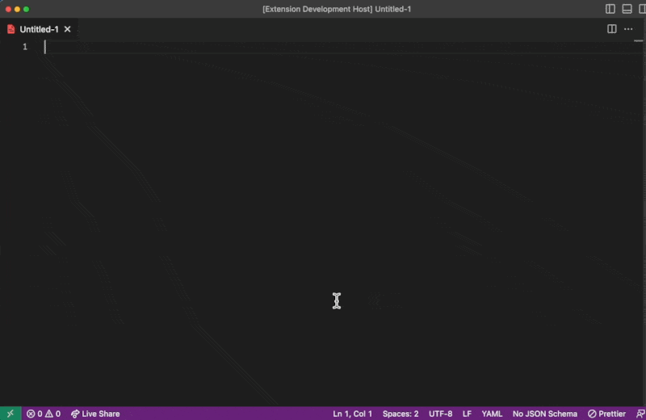
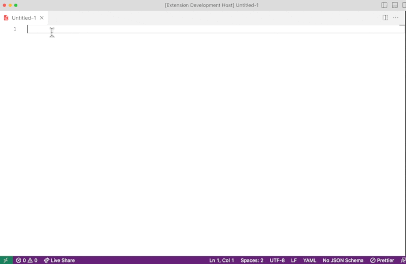

# vscode-opencontext README

The OpenContext VSCode extension will help you write catalog YAML files for PlatformComponents, Platforms, Schemes, and other entities.

## Features

Snippets available:
- Components
  - AuxComponent: `auxc`
  - CodeComponent: `codec`
  - PlatformComponent: `platformc`
  - CodeComponentSidecar: `sidecar`
- Datacenter: `datac`
- Platform: `ocplatform`
- Scheme: `ocscheme`
- Team: `octeam`
- Person: `ocperson`
- User: `ocuser`
- Links: `oclink`
- Annotations:
  - Pagerduty: Use `ocpagerservice` for a service ID, and `ocpagerintegration` to use an integration key
  - GitHub: `ocghproj` for a repository and `ocghuser` to connect Person and User records via their GitHub username

## Examples

## Release Notes

### 1.0.0

Initial release.

## For more information

Check out the docs for OpenContext: https://docs.opencontext.com

**Enjoy!**
